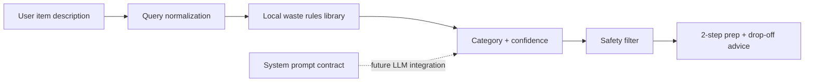

# EcoSorted AI – Smart Household Waste Classification & Recycling Assistant

EcoSorted AI is a lightweight, responsible AI decision-support tool that helps households, university students, and local community members make clearer waste-segregation decisions at the point of disposal.

> **Built for the 1M1B – IBM SkillsBuild AI + Sustainability Virtual Internship**  
> Aligned with **UN Sustainable Development Goal 12: Responsible Consumption and Production** and **SDG 11: Sustainable Cities and Communities**.

## Overview

Everyday waste can be surprisingly difficult to classify. A greasy pizza box, a broken lithium battery, and an old smartphone should not follow the same disposal path, but the correct choice is often unclear. EcoSorted AI turns a plain-language item description into a practical next action.

The prototype classifies user-submitted waste into four core streams:

- **Wet:** Biodegradable food and garden matter.
- **Dry:** Clean, recoverable paper, packaging, glass, metal, and textiles.
- **E-Waste:** Devices, cables, adapters, and electronic accessories.
- **Hazardous:** Batteries, chemicals, medicines, sharps, oils, and other items requiring specialist handling.

By combining simple prompt logic, a local waste-rules knowledge library, and clear safety guidance, the application aims to reduce landfill contamination and improve community participation in responsible waste segregation.

## Key Features

### Real-time query classification

Describe an item in natural language, such as `old smartphone`, `greasy pizza box`, or `broken lithium battery`. The local classifier normalizes the query, matches it against a 25+ item rules library, assigns a category, and shows a confidence signal.

### Three accessible input modes

EcoSorted AI supports three complementary ways to begin a classification:

1. **Direct text search:** Type an item description in the traditional search field and submit with the button or Enter key.
2. **Image upload / camera recognition:** Drag and drop an image, upload from a device, or use a mobile camera input. The prototype performs filename-based visual hint recognition to demonstrate the multimodal flow and returns the same standard result card.
3. **Quick-select chips and guided wizard:** Choose a visual chip for common tricky items, or open the two-question **Help me identify** wizard. The wizard asks whether an item is organic, packaging, or electronic/metal, then whether it is clean/dry, greasy/wet, or dangerous/battery-powered.

All three methods converge on the same category badge, confidence signal, two-step handling guide, safety guardrail, and local drop-off advice. This multi-tier design supports users who prefer typing, visual recognition, or no-typing interaction.

### Two-step preparation guide

Every result includes two practical preparation steps. Examples include rinsing containers, flattening cardboard, erasing data from devices, and taping battery terminals.

### Safety-first disposal advice

Hazardous and potentially dangerous materials are flagged with handling warnings and specialist drop-off recommendations. Unknown items receive conservative fallback guidance: keep them separate and treat items containing batteries, chemicals, liquids, sharp edges, or unknown powders as hazardous until confirmed.

### RAG / prompt workflow view

The interface visualizes the decision flow from item input to rules-library lookup, classifier output, and final safety filter. The project also includes a reusable system prompt contract for a future LLM-backed implementation.

### Responsible AI panel

The product makes its design commitments visible through three principles:

- **Safety & guardrails:** Hazardous items are surfaced clearly with specific precautions.
- **Privacy first:** The static prototype performs classification in the browser and stores no personal query history.
- **Fairness & accessibility:** Plain language, four clear streams, visible category colors, and concise instructions keep the tool approachable across ages and contexts.

### SDG impact dashboard

The dashboard communicates the project’s intended civic and environmental impact through SDG alignment, community awareness counters, and an estimated contamination-reduction indicator.

## Technical Stack

- **HTML5** and semantic responsive layout
- **React 19 + TypeScript** for the interactive application
- **Tailwind CSS 4** and custom CSS tokens for the visual system
- **Lucide React** for lightweight interface icons
- **Vite** for development and production builds
- **Local deterministic rules engine** in `client/src/lib/classifier.ts`
- **DM Sans, DM Serif Display, and DM Mono** typography via Google Fonts

## Architecture



### System prompt contract

```json
{
  "role": "system",
  "content": "You are an AI Sustainability Assistant specialized in waste management. Classify user queries into [Wet, Dry, E-Waste, Hazardous]. Provide 2 preparation steps and a safety rule."
}
```

## Project Structure

```text
client/
  index.html
  src/
    App.tsx
    index.css
    lib/classifier.ts
    pages/Home.tsx
docs/
  ecosorted-ai-slide-deck.md
server/
  index.ts
shared/
  const.ts
```

## Local Development

```bash
pnpm install
pnpm dev
```

Run type checking and a production build:

```bash
pnpm check
pnpm build
```

## Documentation

The requested 8-slide internship presentation outline is available at [`docs/ecosorted-ai-slide-deck.md`](docs/ecosorted-ai-slide-deck.md). It covers the problem statement, SDG alignment, target users, design-thinking process, system architecture, responsible AI, expected impact, and future roadmap.

## Responsible Use

EcoSorted AI is a decision-support prototype, not a substitute for official municipal guidance. Waste rules vary by city, campus, and collection provider. When an item is unknown, damaged, leaking, swollen, hot, or potentially toxic, keep it isolated and contact the appropriate local hazardous-waste, medical-waste, battery, or e-waste authority before disposal.

## License

This project is released under the **MIT License**. See [`LICENSE`](LICENSE) for the full text.

## Author

**EcoSorted AI Project Team**  
Created for the **1M1B – IBM SkillsBuild AI + Sustainability Virtual Internship**.

Contributions, classroom adaptations, and responsible local-rule improvements are welcome.
